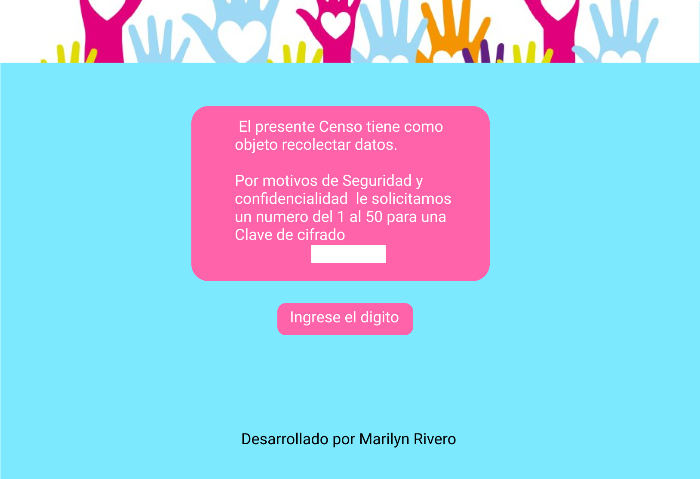
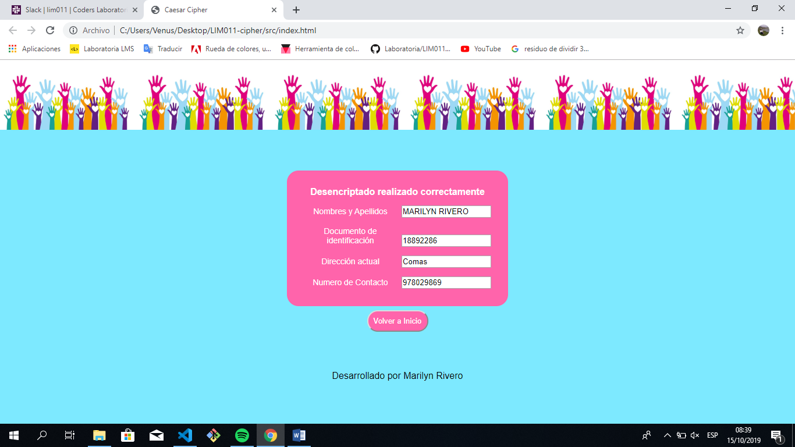
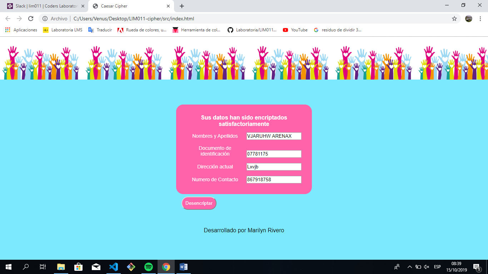
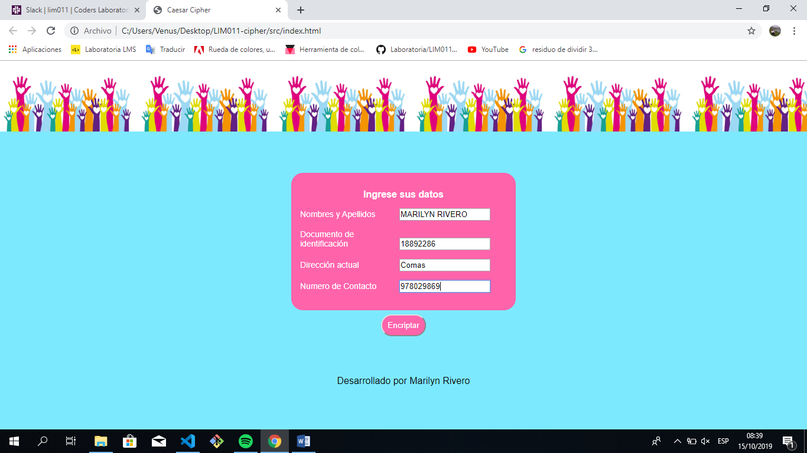
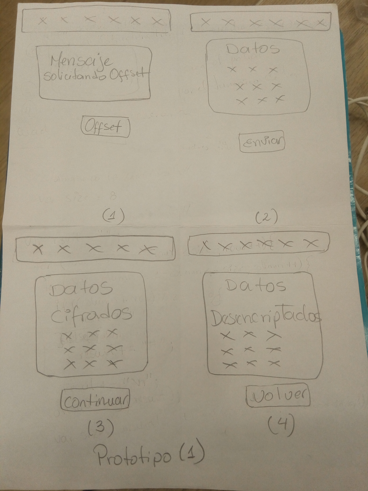
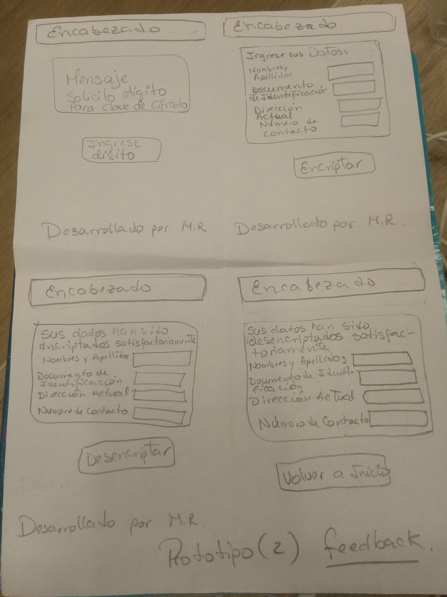
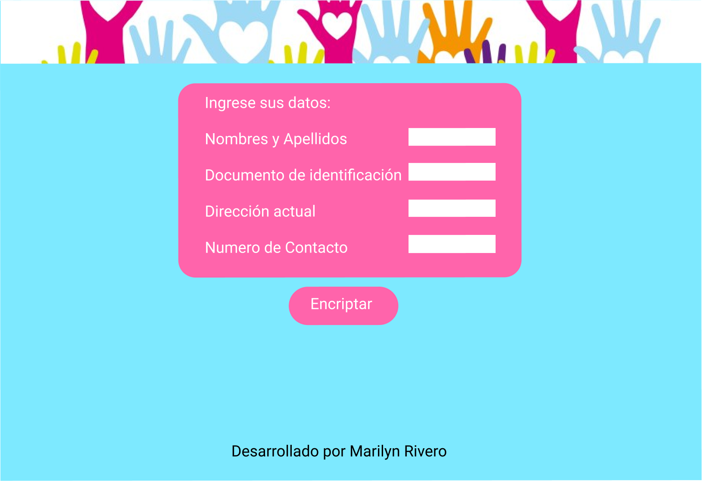
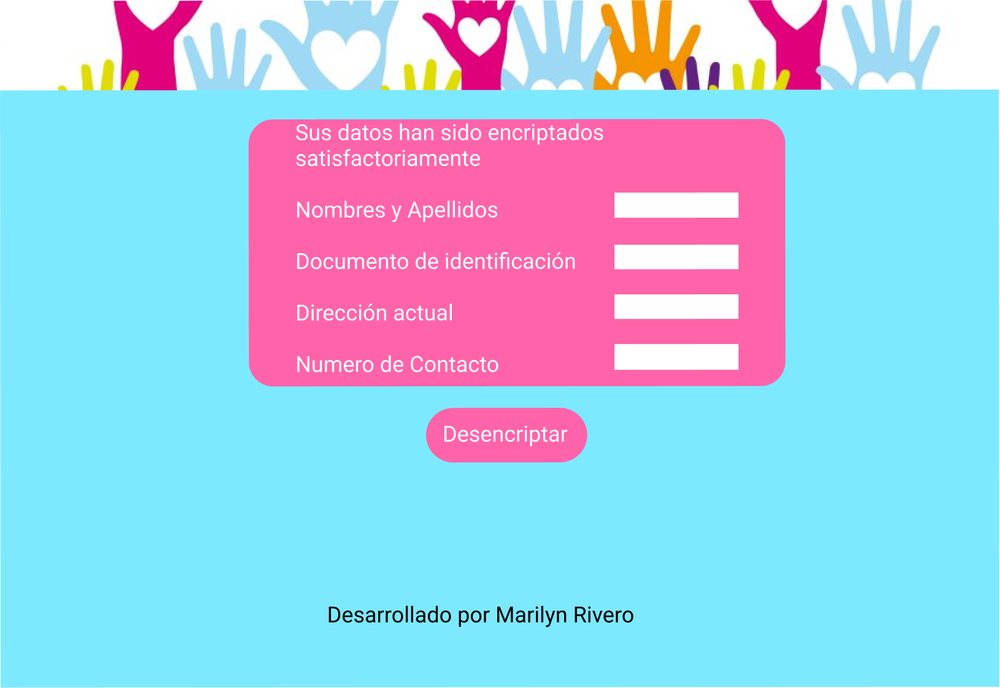
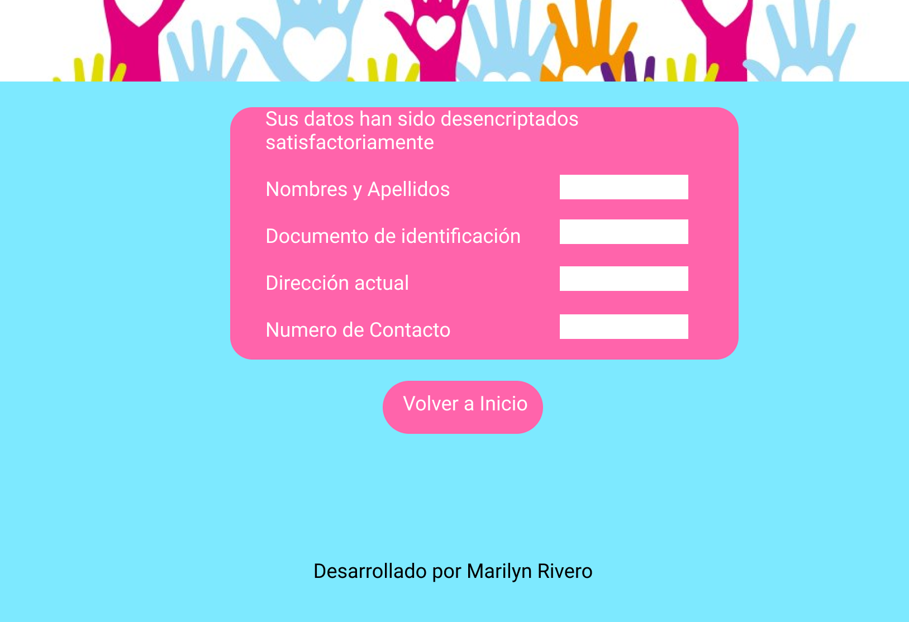

## Cifrado de datos

Es una aplicación desarrolada con el objeto de brindar al usuario el resguardo de información a través de un cifrado de letras y numeros; en el caso de realizar Censos y/o actualizalización de datos.

  ### La imagen final del proyecto
Se elaboró con Figma el siguiente prototipo

## Investigación UX:

### ¿Quiénes son los usuarios y los objetivos en relación con el producto?

  El proyecto "Cifrado de datos", va dirigido a cualquier organización que requiera realizar un censo o actualizar la data de sus clientes; blindando la información recibida.

### ¿Cómo el producto soluciona los problemas/necesidades de los usuarios?
  "Cifrado de datos" es una aplicación web en la que el usuario escoge un desplazamiento del 1 al 9, en donde cada letra del texto original es reemplazada por otra que se encuentra un número fijo de posiciones
  (desplazamiento) más adelante en el mismo alfabeto.  Uno de los grandes miedos de la población es el manejo de la información que suministran, por lo que el proyecto "Cifrado de datos" le permite a sus usuarios tener la tranquilidad de que la información que han dado, se verán reflejados pero de forma encriptada.
    
### Foto del primer prototipo en papel

### Resumen del feedback recibido indicando las mejoras a realizar:

  Para el proyecto se realizo un primer protipo en papel, en el que le realizaron los siguientes cambios según feedback recibido:
  * Se le cambio el nombre al botón de la primera vista, ya que el término (Offset) era poco entendible, por lo que se paso de Offset a Ingrese el dígito. Asi misimo, se realizó un cambio en el mensaje solicitandole un dígito del 1 al 9 para crear una clave de cifrado.

  * A la segunda vista se le colocó un formulario para recibir la información del usuario. Por otro lado se le cambio el nombre al botón para generar más confianza con el usuario; se pasó de "Enviar" a "Encriptar".

  * A la tercera vista se le colocó un formulario para recibir la información del usuario. Por otro lado se le cambio el nombre al botón para generar más confianza con el usuario; se pasó de "Continuar" a "Desencriptar".

### Imagen del prototipo final.

## Objetivos de aprendizaje Cipher

A continuación te presentamos los objetivos de aprendizaje de este proyecto. Reflexiona y luego marca los objetivos que has llegado a **entender** y **aplicar** en tu proyecto.

### UX

- [X] Diseñar la aplicación pensando y entendiendo al usuario.
- [X] Crear prototipos para obtener feedback e iterar.
- [ ] Aplicar los principios de diseño visual (contraste, alineación, jerarquía).

### HTML y CSS

- [X] Uso correcto de HTML semántico.
- [X] Uso de selectores de CSS.
- [X] Construir tu aplicación respetando el diseño realizado (maquetación).

### DOM

- [X] Uso de selectores del DOM.
- [X] Manejo de eventos del DOM.
- [ ] Manipulación dinámica del DOM.

### Javascript

- [X] Manipulación de strings.
- [ ] Uso de condicionales (if-else | switch).
- [ ] Uso de bucles (for | do-while).	
- [X] Uso de funciones (parámetros | argumentos | valor de retorno).
- [X] Declaración correcta de variables (const & let).

### Testing
- [ ] Testeo de tus funciones.

### Git y GitHub
- [X] Comandos de git (add | commit | pull | status | push).
- [ ] Manejo de repositorios de GitHub (clone | fork | gh-pages).

### Buenas prácticas de desarrollo
- [X] Uso de identificadores descriptivos (Nomenclatura | Semántica).
- [X] Uso de linter para seguir buenas prácticas (ESLINT).

